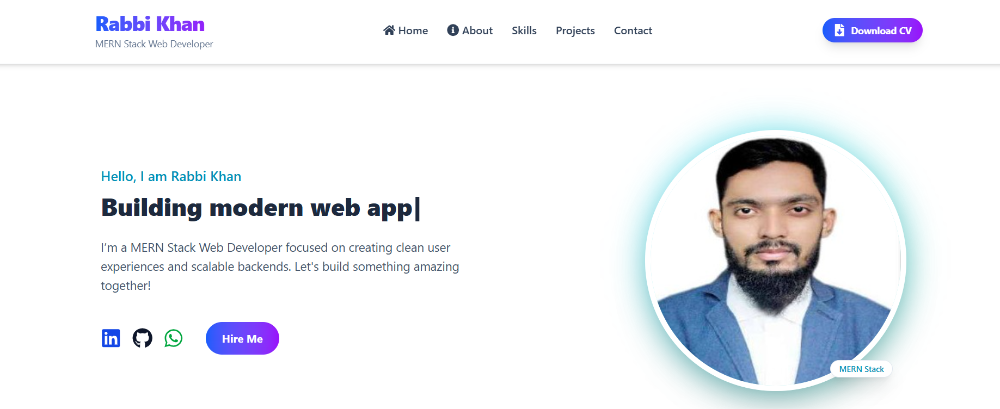

<div align="center">

  #  Rabbi Khan — Portfolio

  **A modern, fully responsive developer portfolio showcasing a Mern-Stack MERN journey.**

  
  
  

  [View Live Demo](https://rabbi-khan.vercel.app/) • [Report Bug](https://github.com/yourusername/portfolio/issues) • [Request Feature](https://github.com/yourusername/portfolio/issues)

</div>


---

##  About The Project

This portfolio highlights my projects, skills, and professional journey as a **Mern-Stack Web Developer** with expertise in the **MERN stack**. It is built with performance and aesthetics in mind, utilizing **React** for structure, **Tailwind CSS** for styling, and **Framer Motion** for fluid animations.

###  Preview


*(Note: Ensure your image path matches your repository structure)*

---

##  Tech Stack

I utilized the following technologies to build a fast, interactive, and scalable application:

| **Category** | **Technologies** |
| :--- | :--- |
| **Frontend** |   |
| **Styling** |  |
| **Animation** |   |
| **Backend & Tools** |   |

---

##  Key Features

*  **Fully Responsive:** Seamless experience across mobile, tablet, and desktop.
*  **Interactive Hero Section:** Features typewriter effects and orbiting skill icons.
*  **Modern UI/UX:** Dark minimalist theme with a custom cursor.
*  **High Performance:** Optimized build using **Vite**.
*  **Smooth Animations:** Fade, slide, and rotation effects powered by Framer Motion.
*  **Dynamic Project Showcase:** Hover effects and detailed project cards.
*  **Direct Contact Integration:** Easy access to LinkedIn and Email.

---

##  Sections Overview

| Section | Description |
| :--- | :--- |
| **Header** | Clean navigation with social links and clear calls to action. |
| **Hero** | High-impact introduction with animated elements. |
| **Projects** | curated list of works with tech stacks and live demos. |
| **Skills** | A visual grid displaying my technical expertise. |
| **Contact** | Simple layout to get in touch directly. |
| **Footer** | Minimalist copyright and social footer. |

---

## Installation & Setup

Follow these steps to get a local copy up and running.

**Prerequisites**
* Node.js (v14 or higher)
* npm or yarn

**Installation**

1.  **Clone the repository**
    ```bash
    git clone [https://github.com/yourusername/portfolio.git](https://github.com/yourusername/portfolio.git)
    ```

2.  **Navigate to the project directory**
    ```bash
    cd portfolio
    ```

3.  **Install dependencies**
    ```bash
    npm install
    ```

4.  **Start the development server**
    ```bash
    npm run dev
    ```

---
